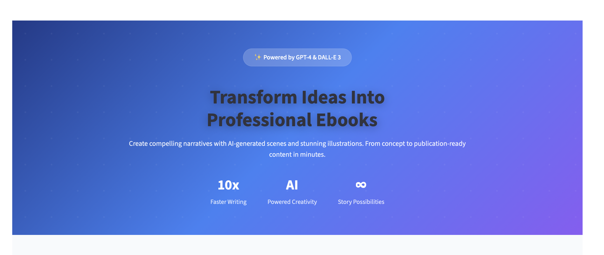
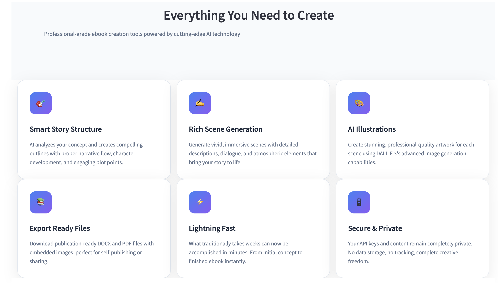
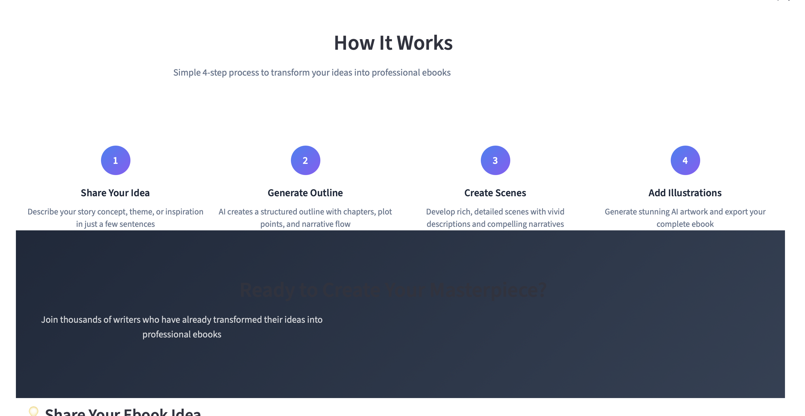
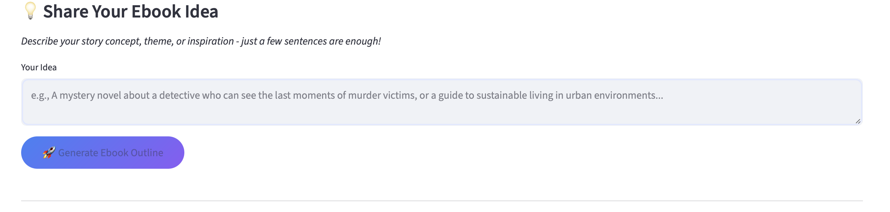

# ✨ Ebook Writer – AI-Powered Story & Ebook Generator



## 🌟 Introduction

The **Ebook Writer** is an **AI-powered Streamlit app** that helps you transform ideas into **professional ebooks**.  
Powered by **GPT-4** and **DALL·E 3**, the app generates **titles, outlines, full scenes, and illustrations**.  
Finally, you can export your creation to **DOCX** or **PDF** — ready for publishing or sharing.  

⚠️ **Note**: You’ll need your own **OpenAI API key** to run the app.

---

## ✨ Features

- 🎯 **Smart Story Structure** – AI creates engaging outlines  
- ✍️ **Rich Scene Generation** – vivid, detailed descriptions  
- 🎨 **AI Illustrations** – DALL·E 3-generated artwork  
- 📚 **Export Ready** – download as DOCX (with images) or PDF  
- 🔒 **Secure** – your API key stays private  

---

## 📸 Screenshots

### Hero Section


### Generated Outline


### Scene & Illustration


---

## 🚀 Quick Start

### 1️⃣ Clone the repo
```bash
git clone https://github.com/your-username/ebook_writer_ai.git
cd ebook-writer-ai


ebook-writer-ai/
├── app.py                # Streamlit app
├── requirements.txt      # Python dependencies
├── README.md             # Project description
├── LICENSE               # MIT License
└── assets/               # Folder for screenshots

